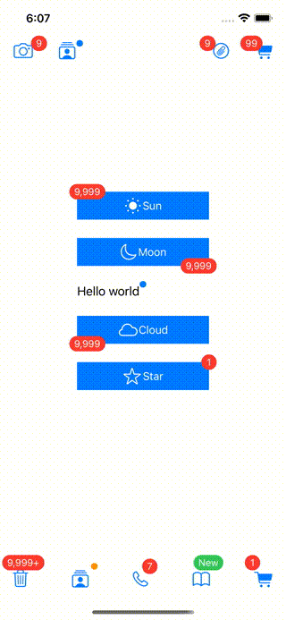

# UIViewBadge

Add notification badge to UIView(UIBarButtonItem)



## Requirements

* iOS 13 or later

## Installation
### Swift Package Manager
Add the following to your Package.swift file:

```swift
dependencies: [
    .package(url: "https://github.com/takimoto3/uiview-badge", .upToNextMajor(from: "0.1.0")),
]
```

## Usage

```swift
// Setup
button.setupBadge(.init(alignment: .topLeading(x: 0, y: 0)))

label.setupBadge(.init(type: .dot, alignment: .topTrailing(x: -90, y: 10), circleColor: UIColor.systemOrange))

if let barButton = self.navigationItem.leftBarButtonItems?[0] {
    barButton.setupBadge(.init(alignment: .topTrailing(x: -5, y: 12)))
}    

// Show badge
button.showBadge("1", animated: false)
label.showBadge()
if let barButton = self.navigationItem.leftBarButtonItems?[0] {
    barButton.showBadge("1")
}    

// Hide badge
button.hideBadge()
label.hideBadge()
if let barButton = self.navigationItem.leftBarButtonItems?[0] {
    barButton.hideBadge()
}    


```

## Customization

### BadgeConfiguration
Configure the badge using values from the BadgeConfiguration class as arguments to SetupBadge. Default values are:
```swift
    public init(type: BadgeType = .normal,
                alignment: BadgeAlignment = .topTrailing(x: 0, y: 0),
                borderColor: UIColor = .clear,
                boderWidth: CGFloat = 0.0,
                circleColor: UIColor = .systemRed,
                dotHeight: CGFloat = 9.0,
                badgeHeight: CGFloat? = 21.0,
                font: UIFont = .systemFont(ofSize: 13),
                textColor: UIColor = .white,
                textAlignment: NSTextAlignment = .center,
                maxWidth: CGFloat? = nil,
                appearAnimation: BadgeAppearAnimation? = SimpleAppearAnimation(),
                disappearAnimation: BadgeDisappearAnimation? = SimpleDisappearAnimation(),
                enableShadow: Bool = false,
                opacity: CGFloat = 1.0,
                scaleForLandscape: CGFloat = 0.75) {
        // .... 
    }
```

### Animation

Badge show/hide animations are defined by the BadgeAppearAnimation/BadgeDisappearAnimation protocols. Create classes that satisfy each protocol to customize badge animations.  
See Badge_Animations.swift file for details:
```swift
public protocol BadgeAppearAnimation {
    func animate(circle: UIView, label: UILabel?)
}
```

```swift
public protocol BadgeDisappearAnimation {
    func animate(circle: UIView, label: UILabel?)
}
```

## License

UIView-Badge is available under the MIT license. See the LICENSE file for more info.
